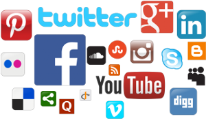

# Social Network Plan

## Abstract

We believe social networks have significant benefits for people and society. However, the big social networks suffer from major problems: data breaches, fake accounts, poor accountability, rife advertising, and restricted rights; these problems harm people and society. 

We want to explore the viability of new social network that aims for more social good. This document is a request for comments and ideas about funding, audiences, scopes, niches, security, and more.

## About

About this document:

* We want this to be a friendly introduction that invites discussion.
* We welcome feedback and suggestions: use [issues](https://github.com/joelparkerhenderson/social_network_plan/issues) or joel@joelparkerhenderson.com or [@joel_henderson](https://twitter.com/joel_henderson)
* This plan is a work in progress and likely to change as we learn more.
* We edit for active present tense, and edit quotations lightly for content and anonymity.

## Context

Context of this project:
* We are looking at the biggest social networks such as 
[Facebook](https://facebook.com),
[Twitter](https://twitter.com),
[LinkedIn](https://linkedin.com).
* We are looking at newer social networks such as
[MeWe](https:://mewe.com), [Vero](https://www.vero.co/), [Ello](https://ello.co/).
* We admire distributed social networks such as
[Mastodon](https://mastodon.social) and
[Patchwork](https://github.com/ssbc/patchwork).
* We like websites that use technology for social good such as 
[Wikipedia](https://wikipedia.org) and
[Craigslist](https://craigslist.org).
* We look to foundations such as 
[Electronic Frontier Foundation (EFF)](http://eff.org/) and
[Free Software Foundation (FSF)](http://fsf.org).
* We admire FLOSS groups such as 
[Open Source Initiative (OSI)](http://opensource.org/) and 
[Software Freedom Conservancy (SFC)](https://sfconservancy.org/).
* We use social coding sites such as 
[GitHub](https://github.com) and
[StackOverflow](https://stackoverflow.com).
* We use social identity tools such as 
[GPG](https://www.gnupg.org/) and
[Keybase](keybase.io).
* We give to crowdfunding such as [Patreon](https://www.patreon.com), [GoFundMe](https://www.gofundme.com/), [Kicksarter](https://www.kickstarter.com).

## Ideas

Ideas that we are exploring - please let us know your comments.

Big ideas:

* [**Audiences**: general public, niches, special interests?](docs/ideas/audiences.md)
* [**Comparisons**: similarities/differences versus others?](docs/ideas/comparisons.md)
* [**Communities**: how can we encourage people to help?](docs/ideas/communities.md)
* [**Motivations**: gamification, extrinsic, intrinsic?](docs/ideas/motivations.md)
* [**Funding**: advertisements, donations, subscriptions?](docs/ideas/funding.md)
* [**References**: articles, blogs, commentaries, etc.](docs/ideas/references.md)

Implementation ideas:

* [**Scopes**: benefits, features, minimum viable product?](docs/ideas/scopes.md)
* [**Names**: real names, fake names, no names?](docs/ideas/names.md)
* [**Feeds**: linear, algorithmic, customizable?](docs/ideas/feeds.md)
* [**Data**: who owns it, who uses it, who controls it?](docs/ideas/data.md)
* [**Policies**: privacy, disclosure, conduct?](docs/ideas/policies.md)

Technology ideas:

* [**Topologies**: centralize, decentralize, distribute, federate?](docs/ideas/topology.md)
* [**Routes**: how to reach people, places, items, resources?](docs/ideas/routes.md)
* [**Project management**: priorities, expectations, timelines, tools, etc.](docs/implementations/projectmanagement.md)
* [**Stacks**: languages, frameworks, databases, interfaces, etc.](docs/implementations/stacks.md)
* [**Security**: spammers, hackers, masqueraders?](docs/ideas/security.md)

<!--
Original content vs. resharing

* "Reshares are part and parcel of a community - even before the days of the Internet. For many, gossip is part of socializing. A friend posted that he's just getting married. People will want to spread the word. How can they without reshares? Rewrite it themselves? Resharing is simply part of usual human interaction."
-->

<!-- How to describe a social network?

We see challenges in how people describe social networks; we suggest starter questions.

Examples:

* **Benefits**: give me reasons to try your product.
* **Privacy**: what is your privacy policy, including sharing with 3rd party?
* **Platform**: is your product aiming to be a platform, API, plugin, integation, etc.?
* **Access**: mobile, web, desktop, native, etc.?
* **Code**: open source, closed source, etc.?
* (more?)

-->

<!--

User Experience

Sign in

Discuss sign in options via:
* Email address and password
* Multi-factor e.g. mobile phone SMS, Google Authenticator app
* Providers e.g. Google, Facebook, LinkedIn
* Protocols e.g. OAuth, SAML
* Integrators e.g. Okta.com

Stories

Discuss stories:
* Can we use RSS?
* Can we use Atom?
* Why/how to provide what companies say they want, e.g. ads, analytics, branding?

-->
